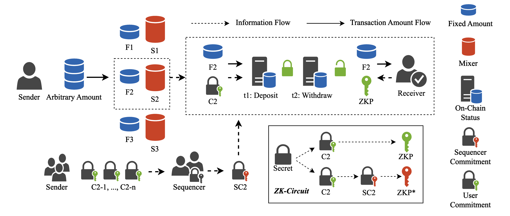
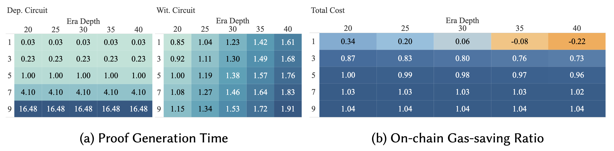
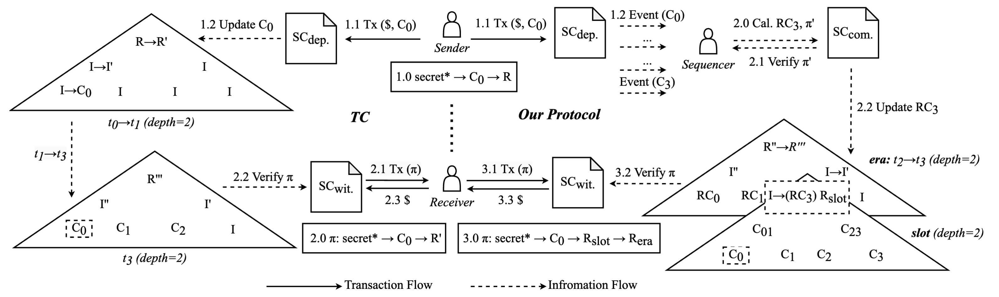

# Implementation of a Cost-Effective Blockchain Privacy Protocol Based on ZK-SNARKs

This repository builds on [Tornado Cash (*TC*)](https://github.com/tornadocash/tornado-core.git) to provide a batch processing ZK Mixer solution. Users switch from individually making deposit operations on the blockchain's smart contracts to executing through sequencers. This process is similar to the ZK layer2 approach: (1) Sequencers record transaction information in a fully binary tree called *slot* while packaging each batch of transactions and generate the corresponding ZKP. (2) When generating the ZKP for withdrawal, users first need to prove that their commitment exists in the *slot,' and then prove that the *slot* exists in the global state managed by the on-chain smart contract, similar to the incremental Merkle tree used by Tornado Cash to store global state, which we call *era*.

In the above diagram, we compare our implementation with the *TC* process as a baseline. The workflow using batch processing is illustrated with one of the mixer pools, *S2*.

## Installation

1. Clone the repo: `git clone https://github.com/hanzeG/circom-zkmixer.git`

2. Install pre-requisites: `npm i`

3. Download Circom: follow the instructions at [installing Circom](https://docs.circom.io/getting-started/installation/).

4. Download snarkjs: `npm install -g snarkjs`

## Test Circuits

Run test case: `npm test`

- Circuit 1: Simulate the process of a sequencer packaging 32 transactions into a *slot.*'* The *slot*'* is a complete binary tree constructed using the MiMC Sponge hash function from [Circomlib](https://github.com/iden3/circomlib), with a depth of 5. The leaf nodes of the *slot*'* are commitments generated by the Pedersen hash function from each transaction's information. The left and right preimages of each commitment are defined by [Tornado Cash](https://berkeley-defi.github.io/assets/material/Tornado%20Cash%20Whitepaper.pdf) as the *nullifier* and *secret*, respectively, and are simulated using a 32-byte random number generator.

- Circuit 2: Simulate the process of a user generating a ZKP for withdrawal. The user needs to: (1) First, compute the transaction commitment by hashing the nullifier and secret using the Pedersen hash function to prove their legitimate identity. (2) Then, prove that the transaction commitment exists in the *slot,* meaning the transaction has been included in a batch by the sequencer. (3) Finally, prove that the *slot* exists in the current global state *era*. In the test, we simulate the process where, after the sequencer first packages a set of transactions, the initiator of one transaction in this set generates the corresponding ZKP to attempt withdrawal.

## Benchmark

### On Chain Cost
The table below records the gas and cost consumption of our method compared to *TC* after deployment on three different blockchains. As shown in the table, our method reduces costs by over `70% (3.3/ 12.07)` on *EVM-blockchain* and by over `25% (1.14/ 1.54)` on *Hedera*.

|                             | **TC**            |                  |                    | **Our Protocol** |                |                  |                  |
| --------------------------- | ----------------- | ---------------- | ------------------ | ---------------- | -------------- | ---------------- | ---------------- |
|                             | _Deposit_         | _Withdraw_       | Total              | _Deposit_        | _Commit_       | _Withdraw_       | Total            |
| **Gas** (gas)               | 938,626           | 267,998          | 1,206,624          | 27,880           | 1,135,599      | 267,964          | 1,431,443        |
| **_Ethereum_** (Gwei/ USD)  | 9,390,000 (30.53) | 2,680,000 (8.71) | 12,070,000 (39.24) | 270,000 (0.87)   | 350,000 (1.14) | 2,680,000 (8.71) | 3,300,000        |
| **_Hedera_** (HBAR/ USD)    | 0.96 (0.13)       | 0.58 (0.08)      | 1.54 (0.22)        | 0.53 (0.07)      | 0.03 (0.00)    | 0.58 (0.08)      | 1.14             |
| **_BNB Chain_** (Gwei/ USD) | 9,390,000 (5.72)  | 2,680,000 (1.63) | 12,070,000 (7.35)  | 270,000 (0.16)   | 350,000 (0.21) | 2,680,000 (1.63) | 3,300,000 (2.01) |

*Note: Values for `Our Protocol` are shown in both Gwei and USD for comparison.*

### Prover Time and On-chain Gas Saving Ratio

*Note: Figure `a` illustrates the relationship between `era` and `slot` depth on the prover time for `circuit 1` and `circuit 2`. The prover time of `slot depth = 5` and `slot depth = 20` is set to be uint 1. Figure `b` shows the variation in the reduction of the final on-chain total gas consumption as the depths of `slot` and `era` change. In the current experimental configuration, where the depths of `slot` and `era` are 5 and 20, respectively, the on-chain cost reduction percentage is taken as unit 1. Under other conditions, a result greater than 1 indicates more savings in gas compared to the current experimental configuration, while a result less than 1 indicates higher expenses.*

## Workflow

In the diagram below, we provide a detailed comparison between our implementation and the main *TC* process. The key difference is that in our scheme, in addition to the original on-chain state storage Merkle tree from *TC*, which we call *era*, we also introduce an off-chain state storage Merkle tree for storing each batch of packaged transactions, which we call *slot*.

The left and right parts of the diagram respectively illustrate the interaction workflows among the main entities in the *TC* protocol and in our modified protocol. In the *TC* protocol workflow, using an incremental Merkle tree of depth 2 as an example, we demonstrate the main steps of completing a deposit at time *t0*-*t1* and a withdraw at time *t3*. In the workflow of the modified protocol, using the same depth 2 incremental Merkle tree *era* and a fully populated Merkle tree *slot* as examples, we show the main steps of the sequencer completing a batch submission at time *t2*-*t3*, and the user performing a withdraw at the same time.